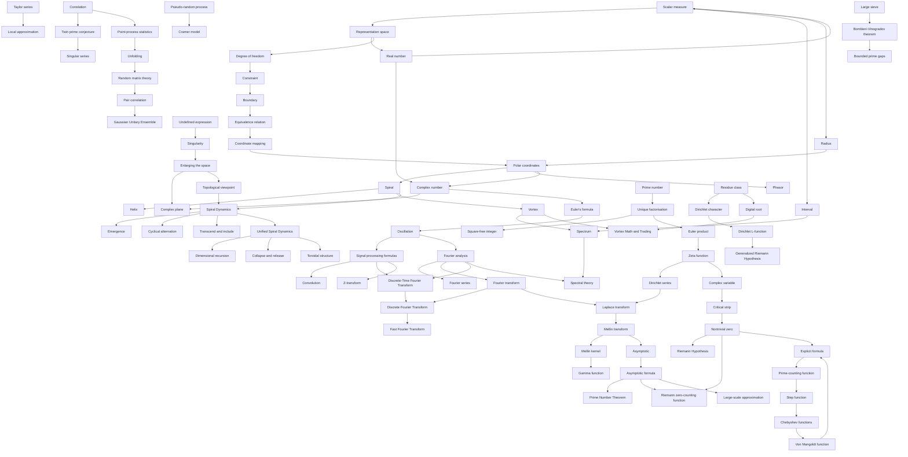

	# Mathematical Fundamentals

This document is a layered guide to mathematical concepts, vocabulary, formulas, and relationships used in the historical account.

Companion connection pages: [Formula Bonds](formula-bonds/README.md).

## Concept Ontology and Topology

This document can be read in two ways:

- As an **ontology**: concepts are grouped by the kind of mathematical role they play.
- As a **topology**: concepts form neighborhoods and bridges, so moving from one concept to another changes the space of thought.

### Ontology: Concept Neighborhoods

| Neighborhood | Core question | Concepts |
|---|---|---|
| Representation and space | What kind of space makes the relationship expressible? | [Representation space](#representation-space), [Degree of freedom](#degree-of-freedom), [Constraint](#constraint), [Boundary](#boundary) [Topological viewpoint](#topological-viewpoint), [Enlarging the space](#enlarging-the-space), [Real number](#real-number), [Scalar measure](#scalar-measure) [Radius](#radius), [Pythagorean theorem](#pythagorean-theorem) |
| Coordinates, cycles, and identification | When are different coordinates the same object? | [Coordinate mapping](#coordinate-mapping), [Identification](#identification), [Equivalence relation](#equivalence-relation), [Polar coordinates](#polar-coordinates) [Spiral](#spiral), [Helix](#helix), [Vortex](#vortex), [Complex number](#complex-number) [Phasor](#phasor), [Euler's formula](#eulers-formula), [Multiplication by i](#multiplication-by-i) |
| Breakdown and repair | Where does an old representation fail, and what replaces it? | [Undefined expression](#undefined-expression), [Singularity](#singularity), [Normalisation](#normalisation), [Complex plane](#complex-plane) [Complex number](#complex-number), [Complex variable](#complex-variable) |
| Counting and arithmetic structure | What is being counted, filtered, or factorised? | [Prime number](#prime-number), [Square number](#square-number), [Square root of one half](#square-root-of-one-half), [Square-free integer](#square-free-integer) [Prime-counting function](#prime-counting-function), [Sieve](#sieve), [Unique factorisation](#unique-factorisation), [Digital root](#digital-root) [Residue class](#residue-class), [Greatest common divisor](#greatest-common-divisor), [Euler totient function](#euler-totient-function) |
| Analytic bridges | How do functions reveal arithmetic structure? | [Zeta function](#zeta-function), [Euler product](#euler-product), [Analytic number theory](#analytic-number-theory), [Signal processing formulas](#signal-processing-formulas), [Convolution](#convolution), [Fourier analysis](#fourier-analysis), [Fourier series](#fourier-series), [Fourier transform](#fourier-transform) [Discrete-Time Fourier Transform](#discrete-time-fourier-transform), [Discrete Fourier Transform](#discrete-fourier-transform), [Fast Fourier Transform](#fast-fourier-transform), [Z-transform](#z-transform), [Laplace transform](#laplace-transform), [Mellin transform](#mellin-transform), [Mellin kernel](#mellin-kernel), [Gamma function](#gamma-function) [Dirichlet series](#dirichlet-series), [Logarithm](#log), [Natural logarithm](#natural-logarithm), [Logarithmic integral](#logarithmic-integral), [Dirichlet character](#dirichlet-character), [Dirichlet L-function](#dirichlet-l-function), [Logarithmic derivative](#logarithmic-derivative) |
| Approximation and infinity | How does a complex object simplify at large scale or near a point? | [Asymptotic](#asymptotic), [Asymptotic formula](#asymptotic-formula), [Taylor series](#taylor-series), [Indeterminate form](#indeterminate-form) [L'Hopital's rule](#lhopitals-rule), [Big O notation](#big-o-notation), [Heuristic](#heuristic), [Empirical constant](#empirical-constant), [Mills-type constant](#mills-type-constant) |
| Zeros, waves, and spectral structure | How do hidden frequencies or zeros govern visible patterns? | [Nontrivial zero](#nontrivial-zero), [Critical strip](#critical-strip), [Riemann Hypothesis](#riemann-hypothesis), [Riemann zero-counting function](#riemann-zero-counting-function) [Explicit formula](#explicit-formula), [Oscillation](#oscillation), [Signal](#signal), [Signal processing formulas](#signal-processing-formulas), [Fourier analysis](#fourier-analysis), [Spectrum](#spectrum), [Vortex](#vortex), [Spectral theory](#spectral-theory) |
| Distribution and statistics | How regular is an apparently irregular sequence? | [Prime Number Theorem](#prime-number-theorem), [Step function](#step-function), [Chebyshev functions](#chebyshev-functions), [Von Mangoldt function](#von-mangoldt-function), [Correlation](#correlation), [Point-process statistics](#point-process-statistics) [Unfolding](#unfolding), [Convergent series](#convergent-series), [Divergent series](#divergent-series), [Harmonic series](#harmonic-series), [Prime reciprocal series](#prime-reciprocal-series) |
| Models, conjectures, and large-scale control | Which models or theorems describe prime patterns beyond first order? | [Twin prime conjecture](#twin-prime-conjecture), [Singular series](#singular-series), [Pseudo-random process](#pseudo-random-process), [Cramer model](#cramer-model) [Random matrix theory](#random-matrix-theory), [Pair correlation](#pair-correlation), [Gaussian Unitary Ensemble](#gaussian-unitary-ensemble), [Large sieve](#large-sieve) [Bombieri-Vinogradov theorem](#bombieri-vinogradov-theorem), [Generalized Riemann Hypothesis](#generalized-riemann-hypothesis), [Bounded prime gaps](#bounded-prime-gaps), [Zero-free region](#zero-free-region), [Elementary proof](#elementary-proof), [Complex analysis](#complex-analysis) |
| Cross-domain frameworks | Which non-mathematical frameworks use mathematical shape, topology, or dynamics as organizing metaphors? | [Vortex Math and Trading](#vortex-math-and-trading), [Spiral Dynamics](#spiral-dynamics), [Unified Spiral Dynamics](#unified-spiral-dynamics) |

### Topology: Main Concept Bridges

### Suggested Reading Paths

- **Geometric path:** [Scalar measure](#scalar-measure) → [Representation space](#representation-space) → [Degree of freedom](#degree-of-freedom) → [Constraint](#constraint) → [Boundary](#boundary) → [Coordinate mapping](#coordinate-mapping) → [Complex number](#complex-number)
- **Vocabulary path:** [Point](#point) → [Coordinate](#coordinate) → [Interval](#interval) → [Spectrum](#spectrum) → [Spectral theory](#spectral-theory)
- **Breakdown path:** [Undefined expression](#undefined-expression) → [Singularity](#singularity) → [Enlarging the space](#enlarging-the-space) → [Complex plane](#complex-plane) → [Topological viewpoint](#topological-viewpoint)
- **Prime-to-zeta path:** [Prime number](#prime-number) → [Unique factorisation](#unique-factorisation) → [Euler product](#euler-product) → [Zeta function](#zeta-function) → [Complex variable](#complex-variable) → [Nontrivial zero](#nontrivial-zero)
- **Transform path:** [Fourier analysis](#fourier-analysis) → [Fourier transform](#fourier-transform) → [Laplace transform](#laplace-transform) → [Mellin transform](#mellin-transform) → [Gamma function](#gamma-function) → [Zeta function](#zeta-function) → [Dirichlet series](#dirichlet-series)
- **Approximation path:** [Taylor series](#taylor-series) → [Asymptotic](#asymptotic) → [Asymptotic formula](#asymptotic-formula) → [Big O notation](#big-o-notation) → [Prime Number Theorem](#prime-number-theorem) → [Riemann zero-counting function](#riemann-zero-counting-function)
- **Statistical path:** [Correlation](#correlation) → [Point-process statistics](#point-process-statistics) → [Unfolding](#unfolding) → [Random matrix theory](#random-matrix-theory) → [Pair correlation](#pair-correlation)

### Bridge Grammar

| Relation | From | To | Meaning |
|---|---|---|---|
| Enlarges | [Scalar measure](#scalar-measure) | [Representation space](#representation-space) | A single number is replaced by a richer space of possible relationships. |
| Measures continuously | [Real number](#real-number) | [Scalar measure](#scalar-measure) | A point on the real line can measure a continuous one-dimensional quantity. |
| Extends | [Real number](#real-number) | [Complex number](#complex-number) | The real line is enlarged by adding an independent imaginary direction. |
| Spans | [Interval](#interval) | [Spectrum](#spectrum) | A specific gap or span is distinguished from the whole range of possible values. |
| Structures | [Degree of freedom](#degree-of-freedom) | [Constraint](#constraint) | Extra freedom becomes mathematically useful only when its meaning is constrained. |
| Identifies | [Boundary](#boundary) | [Equivalence relation](#equivalence-relation) | A boundary can make different coordinates represent the same underlying state. |
| Grows while turning | [Polar coordinates](#polar-coordinates) | [Spiral](#spiral) | A radius is allowed to change as the angle changes. |
| Lifts | [Spiral](#spiral) | [Helix](#helix) | Rotation is given a height coordinate, producing a three-dimensional curve. |
| Fills as a field | [Spiral](#spiral) | [Vortex](#vortex) | One rotating curve becomes a family of rotating flow-lines across a space. |
| Stratifies | [Vortex](#vortex) | [Spectrum](#spectrum) | Neighboring flow levels form a continuous range between thresholds. |
| Rotates | [Multiplication by i](#multiplication-by-i) | [Euler's formula](#eulers-formula) | The imaginary direction becomes a language for cycles and rotations. |
| Compresses | [Polar coordinates](#polar-coordinates) | [Phasor](#phasor) | A sinusoid with fixed frequency can be represented by its amplitude and phase as one complex number. |
| Carries information | [Signal](#signal) | [Signal processing formulas](#signal-processing-formulas) | A varying quantity becomes an object that can be shifted, filtered, decomposed, or transformed. |
| Filters through memory | [Convolution](#convolution) | [Signal](#signal) | A system output is built by combining input values with a response pattern. |
| Decomposes | [Fourier analysis](#fourier-analysis) | [Oscillation](#oscillation) | A complicated function is represented as simpler oscillatory components. |
| Periodizes | [Fourier series](#fourier-series) | [Fourier transform](#fourier-transform) | Periodic signals use discrete harmonics; aperiodic signals use a continuous frequency spectrum. |
| Analyzes discrete time | [Discrete-Time Fourier Transform](#discrete-time-fourier-transform) | [Fourier analysis](#fourier-analysis) | An infinite discrete-time signal is represented by a continuous frequency function. |
| Discretizes | [Fourier transform](#fourier-transform) | [Discrete Fourier Transform](#discrete-fourier-transform) | Continuous-frequency ideas are adapted to finite sampled data. |
| Accelerates | [Discrete Fourier Transform](#discrete-fourier-transform) | [Fast Fourier Transform](#fast-fourier-transform) | The same transform is computed by a faster algorithm. |
| Complexifies discrete time | [Z-transform](#z-transform) | [Complex variable](#complex-variable) | A discrete-time sequence is studied as a function of a complex variable $z$. |
| Repairs | [Singularity](#singularity) | [Enlarging the space](#enlarging-the-space) | A point where one representation breaks can motivate a larger or different space. |
| Metaphorizes topology | [Topological viewpoint](#topological-viewpoint) | [Spiral Dynamics](#spiral-dynamics) | A developmental framework uses spatial and dynamic language to describe worldview change. |
| Recurses geometry | [Spiral Dynamics](#spiral-dynamics) | [Unified Spiral Dynamics](#unified-spiral-dynamics) | USD extends spiral-development language into a speculative recursive geometry of dimensional emergence. |
| Encodes | [Unique factorisation](#unique-factorisation) | [Euler product](#euler-product) | The arithmetic structure of integers becomes a product over primes. |
| Filters | [Unique factorisation](#unique-factorisation) | [Square-free integer](#square-free-integer) | A prime factorisation is restricted so no prime appears with exponent greater than 1. |
| Analytifies | [Euler product](#euler-product) | [Zeta function](#zeta-function) | Prime structure is moved into the behavior of an analytic function. |
| Transforms dynamics | [Laplace transform](#laplace-transform) | [Complex variable](#complex-variable) | A time-domain function is represented as a function of complex frequency. |
| Algebraizes | [Laplace transform](#laplace-transform) | [Formula](#formula) | Differentiation and integration can become algebraic operations in the transformed domain. |
| Transforms scale | [Logarithm](#log) | [Mellin transform](#mellin-transform) | Multiplicative scaling is studied through powers $x^{s-1}$ and integration over positive values. |
| Weights by scale | [Mellin transform](#mellin-transform) | [Mellin kernel](#mellin-kernel) | The kernel $x^{s-1}$ is the power lens used inside the transform integral. |
| Produces | [Mellin transform](#mellin-transform) | [Gamma function](#gamma-function) | The Mellin transform of $e^{-x}$ gives the gamma function. |
| Connects to series | [Mellin transform](#mellin-transform) | [Dirichlet series](#dirichlet-series) | Mellin transforms often turn scale-dependent functions into Dirichlet-series information. |
| Linearizes | [Logarithm](#log) | [Logarithmic derivative](#logarithmic-derivative) | Multiplicative structure becomes additive structure. |
| Complexifies | [Zeta function](#zeta-function) | [Complex variable](#complex-variable) | A real-variable object is extended into the complex plane. |
| Localizes | [Taylor series](#taylor-series) | [Asymptotic formula](#asymptotic-formula) | Both approximate, but Taylor series is local while asymptotics describe limiting scale. |
| Counts | [Nontrivial zero](#nontrivial-zero) | [Riemann zero-counting function](#riemann-zero-counting-function) | A sequence of zeros becomes a cumulative counting function. |
| Translates | [Explicit formula](#explicit-formula) | [Prime-counting function](#prime-counting-function) | Information about zeros is translated back into information about primes. |
| Statisticalizes | [Correlation](#correlation) | [Point-process statistics](#point-process-statistics) | Pairwise relationships become part of a broader statistical geometry. |
| Normalizes | [Point-process statistics](#point-process-statistics) | [Unfolding](#unfolding) | A changing density is rescaled so local comparisons become meaningful. |
| Reduces modulo nine | [Residue class](#residue-class) | [Digital root](#digital-root) | Decimal digit sums preserve the remainder modulo 9, except that multiples of 9 are represented by 9 rather than 0 in the usual digital-root convention. |
| Speculates from pattern | [Digital root](#digital-root) | [Vortex Math and Trading](#vortex-math-and-trading) | A true arithmetic cycle is used as a proposed signal source, which requires empirical validation before any trading interpretation. |

## Mathematical Vocabulary

This section is for vocabulary: words that help us read, compare, and speak mathematics. It is intentionally not alphabetical. Terms are grouped by relation: similarity, contrast, common confusion, and conceptual neighborhood.

### Separation Rule

| Layer | Belongs here when | Example |
|---|---|---|
| Vocabulary | The main need is to clarify the meaning of a word. | [Interval](#interval), [Ordinal number](#ordinal-number), [Spectrum](#spectrum) |
| Concept | The main need is to understand a mathematical object, structure, or method. | [Complex number](#complex-number), [Zeta function](#zeta-function), [Sieve](#sieve) |
| Formula | The main need is to state a symbolic relation or approximation. | [Euler's formula](#eulers-formula), [Euler's identity](#eulers-identity), [Asymptotic formula](#asymptotic-formula), [Explicit formula](#explicit-formula) |

If a word points toward a deeper structure, the vocabulary entry should link to the concept rather than duplicate it.

### Counting Words

| Word | Meaning | Close neighbor | Common confusion |
|---|---|---|---|
| [Natural number](#natural-number) | A counting number, usually $1,2,3,\ldots$, sometimes including $0$ by convention. | [Prime number](#prime-number) | Whether $0$ is included depends on convention. |
| [Integer](#integer) | A whole number, positive, negative, or zero. | [Natural number](#natural-number) | Integers include negative whole numbers; natural numbers usually do not. |
| [Square number](#square-number) | A number of the form $n^2$. | [Square-free integer](#square-free-integer) | A square-free integer is usually not square-shaped; it is free of square divisors greater than 1. |
| [Ordinal number](#ordinal-number) | A number-word for position: first, second, third, and so on. | [Index](#index) | Ordinal numbers describe order, not quantity. |
| [Cardinal number](#cardinal-number) | A number-word for amount: one, two, three, and so on. | [Natural number](#natural-number) | Cardinal counts how many; ordinal says which place. |
| [Index](#index) | A label that marks position in a sequence, sum, product, or family. | [Ordinal number](#ordinal-number) | An index may be a label rather than a measured value. |
| [Sequence](#sequence) | An ordered list of objects or values. | [Index](#index) | A sequence is ordered; a set does not require order. |
| [Set](#set) | A collection of distinct objects considered as one object. | [Sequence](#sequence) | Sets care about membership, not repetition or order. |

### Number-System Words

| Word | Meaning | Close neighbor | Common confusion |
|---|---|---|---|
| [Rational number](#rational-number) | A number expressible as a ratio of two integers, with nonzero denominator. | [Integer](#integer) | Every integer is rational, but not every rational number is an integer. |
| [Irrational number](#irrational-number) | A real number not expressible as a ratio of two integers. | [Real number](#real-number) | Irrational does not mean unreasonable; it means not a ratio of integers. |
| [Real number](#real-number) | A number on the ordinary continuous number line. | [Rational number](#rational-number), [Irrational number](#irrational-number), [Scalar measure](#scalar-measure) | Real numbers include rational and irrational numbers, but not imaginary directions. |
| [Complex number vocabulary](#complex-number-vocabulary) | Everyday language for numbers of the form $x+iy$. | [Complex number](#complex-number), [Complex plane](#complex-plane), [Euler's formula](#eulers-formula) | Complex does not mean vague or complicated; it means two-part: real plus imaginary. |
| [Imaginary unit](#imaginary-unit) | The symbol $i$, satisfying $i^2=-1$. | [Multiplication by i](#multiplication-by-i) | Imaginary does not mean unreal; it names a direction outside the real line. |

### Space and Range Words

| Word | Meaning | Close neighbor | Common confusion |
|---|---|---|---|
| [Point](#point) | A location in a space. | [Coordinate](#coordinate) | A point is the object; coordinates are one way to describe it. |
| [Coordinate](#coordinate) | A number or tuple used to locate something in a chosen representation. | [Coordinate mapping](#coordinate-mapping) | The coordinate is not the thing itself. |
| [Interval](#interval) | A gap, distance, or span between two specific points, values, or notes. | [Boundary](#boundary) | In mathematics, an interval is often continuous; in music, it can describe a discrete distance between notes. |
| [Spectrum](#spectrum) | The continuous or comprehensive range of possible values, frequencies, colors, or modes in a system. | [Spectral theory](#spectral-theory) | A spectrum is not one gap; it is the whole range being considered. |
| [Domain](#domain) | The allowed inputs of a function or relation. | [Constraint](#constraint) | Domain is about allowed inputs; range is about produced outputs. |
| [Range](#range) | The values a function or relation can produce. | [Spectrum](#spectrum) | Range can mean actual outputs, while spectrum often emphasizes a whole field of possible modes or frequencies. |

### Comparison and Limit Words

| Word | Meaning | Close neighbor | Common confusion |
|---|---|---|---|
| [Finite](#finite) | Having an end, bound, or limited number of elements. | [Bounded](#bounded) | A finite set is bounded in size; a bounded infinite set can still have infinitely many points. |
| [Infinite](#infinite) | Not finite; without a final count or endpoint in the relevant sense. | [Asymptotic](#asymptotic) | Infinity is not just a very large finite number. |
| [Bounded](#bounded) | Confined within some limit. | [Finite](#finite) | Bounded does not always mean finite. |
| [Continuous](#continuous) | Varying without jumps or gaps in the relevant space. | [Interval](#interval) | Continuous is not the same as merely very detailed. |
| [Discrete](#discrete) | Made of separated values or steps. | [Step function](#step-function) | Discrete does not mean random; it means separated. |
| [Limit](#limit) | The value or behavior approached by a quantity. | [Asymptotic](#asymptotic) | A limit describes approach; it need not be reached. |

### Formula and Approximation Words

| Word | Meaning | Close neighbor | Common confusion |
|---|---|---|---|
| [Expression](#expression) | A mathematical phrase made from symbols, numbers, variables, and operations. | [Formula](#formula) | An expression need not assert a relationship. |
| [Equation](#equation) | A statement that two expressions are equal. | [Equality](#equality) | An equation makes a claim; an expression is just a phrase. |
| [Formula](#formula) | A reusable symbolic rule or relationship. | [Asymptotic formula](#asymptotic-formula) | A formula may be exact, approximate, recursive, or asymptotic. |
| [Euler's identity](#eulers-identity) | The special case $e^{i\pi}+1=0$. | [Euler's formula](#eulers-formula) | The identity is a special case of the formula, not a separate principle. |
| [Approximation](#approximation) | A value or formula close enough to be useful in a chosen context. | [Taylor series](#taylor-series) | Approximate does not mean careless; it means controlled loss of detail. |
| [Equality](#equality) | Exact sameness within a stated mathematical system. | [Identification](#identification) | Equality is not the same as correspondence under a mapping. |

## Cross-Domain Frameworks

This section is for frameworks that are not mathematical objects, formulas, or vocabulary, but that use mathematical-looking structure such as axes, spirals, cycles, topology, emergence, or phase transitions as organizing metaphors.

### Guardrail

Treat these frameworks as **conceptual maps**, not as mathematical proofs. They can help organize intuition, but they should not be confused with formal theorems, measured variables, or exact models unless such formalization is explicitly supplied.

## Vortex Math and Trading

Vortex Math and Trading is a speculative applied framework that tries to use vortex-math digit patterns as signals for stock-market behavior.

The mathematical core is simple and real:

| Ingredient | Established mathematical reading |
|---|---|
| Digital root | Repeatedly sum decimal digits until one digit remains. |
| Number 9 | Digit sums are closely tied to arithmetic modulo 9. |
| Pattern $1,2,4,8,7,5$ | The cycle obtained by repeatedly doubling and reducing modulo 9. |
| Circular diagram | A visualization of a periodic residue pattern. |

For example, the doubling pattern is:

$$
1\rightarrow2\rightarrow4\rightarrow8\rightarrow7\rightarrow5\rightarrow1.
$$

University-level translation: this is the orbit of powers of $2$ among the nonzero residues modulo $9$:

$$
2^n \pmod 9.
$$

So the arithmetic phenomenon is not mysterious. It is modular periodicity.

The trading proposal is a different kind of claim. It asks whether stock prices, after being reduced to digital roots or related residue classes, contain predictive structure.

That claim must be treated as empirical, not mathematical. A valid trading study would need:

| Requirement | Why it matters |
|---|---|
| Out-of-sample testing | Prevents fitting noise from the past. |
| Baseline comparison | Shows whether the method beats simple alternatives. |
| Transaction costs and slippage | Turns paper patterns into realistic trading results. |
| Risk metrics | Measures drawdown, volatility, and Sharpe-like behavior. |
| Multiple-market testing | Checks whether the pattern generalizes. |

The useful conceptual placement is:

$$
\text{digital root}
\quad\longrightarrow\quad
\text{modular cycle}
\quad\longrightarrow\quad
\text{visual vortex pattern}
\quad\longrightarrow\quad
\text{hypothesis for empirical testing}.
$$

Common confusion: a visually striking number cycle is not automatically a causal market signal. The number pattern can be mathematically true while the trading interpretation remains unproven.

Source note: this entry summarizes the Medium article
[Unlocking Financial Secrets: How Tesla's Number Theory and Vortex Math Could Revolutionize Stock Market Trading](https://medium.com/algorithmic-trading/exploring-vortex-math-theory-and-its-application-to-stock-market-trading-5f0d2154c13c),
published June 17, 2024, together with the attached text copy supplied in this workspace. The article presents digital-root vortex patterns, the $1,2,4,8,7,5$ cycle, and exploratory Python-style trading/backtesting ideas.

## Spiral Dynamics

Spiral Dynamics is a developmental framework rooted in Clare W. Graves' emergent-cyclical theory of adult biopsychosocial systems.

It maps human value systems and worldviews as evolving responses to changing life conditions. In the model's own language, these value systems are often called **vMemes**: not fixed personality types, but recurring ways of making sense of problems, priorities, authority, belonging, agency, and change.

The model is useful here because it has a mathematical shape even though it is not mathematics:

- **Spiral:** development is not a straight ladder; it cycles while moving into greater complexity.
- **Double helix:** inner capacities and outer life conditions co-evolve.
- **Vertical axis:** increasing complexity or altitude of worldview.
- **Horizontal polarity:** alternation between individual self-expression and collective belonging.

The core growing mechanism has three parts:

| Mechanism | Meaning |
|---|---|
| Emergent | A new value system appears when current thinking cannot solve current life conditions. |
| Cyclical | The spiral alternates between individual "I/Me" emphasis and collective "We/Us" emphasis. |
| Transcend and include | Later systems do not simply erase earlier ones; they can integrate, regulate, and reuse them. |

The main developmental axes are:

| Axis | Meaning |
|---|---|
| Vertical axis | The upward movement in capacity to handle more complex life conditions. |
| Horizontal axis | The alternating polarity between inner agency and group harmony. |
| First-tier to second-tier pivot | A proposed shift, often described between Green and Yellow, from more absolutist or fragmented viewpoints toward more systemic and integrative thinking. |

For this document, the important connection is structural: Spiral Dynamics is a **topology of development**. It describes how a system can move through stages, encounter limits, generate new operating modes, and integrate earlier layers rather than merely replacing them.

Source note: this entry follows the public Spiral Dynamics overview of Graves' emergent-cyclical levels of existence theory, especially its description of vMEMEs as valuing-system containers and the alternating individualistic and collective poles.

## Unified Spiral Dynamics

Unified Spiral Dynamics, or USD, is a speculative cross-domain framework proposed by Haden Popnoe that extends spiral-development language into a proposed ontology of dimensional recursion.

It should be read as a **conceptual and visual framework**, not as established mathematics or verified physics. Its value in this document is as a structural metaphor for emergence, recursion, dimensional release, and topological imagination.

The central proposal is that structure arises through a repeated dynamic of:

| USD term | Meaning in the framework |
|---|---|
| Collapse | A point or seed is treated not as a static location, but as an inward recursive process. |
| Release | A dimension becomes expressible when one aspect of collapse is loosened or unfolded. |
| Influence | Higher-order dimensions shape lower-dimensional emergence before they are themselves fully expressed. |
| Toroid | The torus is proposed as a stable recursive geometry of collapse and expansion. |
| T-alpha and T-omega | Meta-constructs representing initiating expansion and final collapse outside the ordinary recursive levels. |

The article describes a geometric progression:

$$
\text{pinch} \rightarrow \text{thread} \rightarrow \text{disc} \rightarrow \text{toroid} \rightarrow \text{space-time toroid}.
$$

In this picture, a point is not the beginning of geometry as a finished zero-dimensional object. It is a process of collapse. A line or thread emerges when one direction is released. A disc appears as a second dimension is released. A toroid appears when the next dimension curves the prior structure into a recursive loop.

The framework also proposes a broad analogy between physical structure and recursive geometry:

- constants may be interpreted as equilibrium values of recursive balance;
- time may be treated as an emergent shaping influence rather than merely an external parameter;
- quantum and relativistic descriptions may be viewed as different projections of collapse and expansion;
- consciousness is suggested as a possible higher-order recursion.

These are not mathematical results in the usual sense. They are research prompts or philosophical hypotheses unless formal definitions, equations, predictions, and empirical tests are supplied.

For this document, the important relation is:

$$
\text{topology} + \text{recursion} + \text{dimensional release}
\quad\longrightarrow\quad
\text{a speculative map of emergence}.
$$

Source note: this entry summarizes Haden Popnoe's Medium article
[Unified Spiral Dynamics (USD): A Comprehensive Framework of Dimensional Recursion](https://medium.com/@hpopnoe/unified-spiral-dynamics-usd-a-comprehensive-framework-of-dimensional-recursion-bd531bd1f633),
published July 30, 2025, which presents USD as a conceptual, visual, philosophical, and logical framework rather than a formal mathematical theory.

## Table of Contents

- [Concept Ontology and Topology](#concept-ontology-and-topology)
- [Mathematical Vocabulary](#mathematical-vocabulary)
- [Cross-Domain Frameworks](#cross-domain-frameworks)
- [Vortex Math and Trading](#vortex-math-and-trading)
- [Spiral Dynamics](#spiral-dynamics)
- [Unified Spiral Dynamics](#unified-spiral-dynamics)
- [Representation space](#representation-space)
- [Undefined expression](#undefined-expression)
- [Singularity](#singularity)
- [Degree of freedom](#degree-of-freedom)
- [Constraint](#constraint)
- [Boundary](#boundary)
- [Equivalence relation](#equivalence-relation)
- [Topological viewpoint](#topological-viewpoint)
- [Complex plane](#complex-plane)
- [Complex number](#complex-number)
- [Multiplication by i](#multiplication-by-i)
- [Euler's formula](#eulers-formula)
- [Euler's identity](#eulers-identity)
- [Polar coordinates](#polar-coordinates)
- [Spiral](#spiral)
- [Helix](#helix)
- [Vortex](#vortex)
- [Phasor](#phasor)
- [Coordinate mapping](#coordinate-mapping)
- [Identification](#identification)
- [Enlarging the space](#enlarging-the-space)
- [Scalar measure](#scalar-measure)
- [Radius](#radius)
- [Pythagorean theorem](#pythagorean-theorem)
- [Natural number](#natural-number)
- [Integer](#integer)
- [Square number](#square-number)
- [Square root of one half](#square-root-of-one-half)
- [Ordinal number](#ordinal-number)
- [Cardinal number](#cardinal-number)
- [Index](#index)
- [Sequence](#sequence)
- [Set](#set)
- [Rational number](#rational-number)
- [Irrational number](#irrational-number)
- [Real number](#real-number)
- [Complex number vocabulary](#complex-number-vocabulary)
- [Imaginary unit](#imaginary-unit)
- [Point](#point)
- [Coordinate](#coordinate)
- [Interval](#interval)
- [Spectrum](#spectrum)
- [Domain](#domain)
- [Range](#range)
- [Finite](#finite)
- [Infinite](#infinite)
- [Bounded](#bounded)
- [Continuous](#continuous)
- [Discrete](#discrete)
- [Limit](#limit)
- [Expression](#expression)
- [Equation](#equation)
- [Formula](#formula)
- [Euler's identity](#eulers-identity)
- [Approximation](#approximation)
- [Equality](#equality)
- [Prime number](#prime-number)
- [Square-free integer](#square-free-integer)
- [Prime-counting function](#prime-counting-function)
- [Sieve](#sieve)
- [Zeta function](#zeta-function)
- [Euler product](#euler-product)
- [Unique factorisation](#unique-factorisation)
- [Analytic number theory](#analytic-number-theory)
- [Signal](#signal)
- [Signal processing formulas](#signal-processing-formulas)
- [Convolution](#convolution)
- [Fourier analysis](#fourier-analysis)
- [Fourier series](#fourier-series)
- [Fourier transform](#fourier-transform)
- [Discrete-Time Fourier Transform](#discrete-time-fourier-transform)
- [Discrete Fourier Transform](#discrete-fourier-transform)
- [Fast Fourier Transform](#fast-fourier-transform)
- [Z-transform](#z-transform)
- [Laplace transform](#laplace-transform)
- [Mellin transform](#mellin-transform)
- [Mellin kernel](#mellin-kernel)
- [Gamma function](#gamma-function)
- [Dirichlet series](#dirichlet-series)
- [Logarithm](#log)
- [Natural logarithm](#natural-logarithm)
- [Logarithmic integral](#logarithmic-integral)
- [Empirical constant](#empirical-constant)
- [Asymptotic](#asymptotic)
- [Asymptotic formula](#asymptotic-formula)
- [Taylor series](#taylor-series)
- [Indeterminate form](#indeterminate-form)
- [L'Hopital's rule](#lhopitals-rule)
- [Riemann zero-counting function](#riemann-zero-counting-function)
- [Mills-type constant](#mills-type-constant)
- [Digital root](#digital-root)
- [Residue class](#residue-class)
- [Greatest common divisor](#greatest-common-divisor)
- [Dirichlet character](#dirichlet-character)
- [Dirichlet L-function](#dirichlet-l-function)
- [Step function](#step-function)
- [Chebyshev functions](#chebyshev-functions)
- [Von Mangoldt function](#von-mangoldt-function)
- [Normalisation](#normalisation)
- [Complex variable](#complex-variable)
- [Nontrivial zero](#nontrivial-zero)
- [Critical strip](#critical-strip)
- [Riemann Hypothesis](#riemann-hypothesis)
- [Explicit formula](#explicit-formula)
- [Oscillation](#oscillation)
- [Prime Number Theorem](#prime-number-theorem)
- [Logarithmic derivative](#logarithmic-derivative)
- [Heuristic](#heuristic)
- [Convergent series](#convergent-series)
- [Divergent series](#divergent-series)
- [Harmonic series](#harmonic-series)
- [Prime reciprocal series](#prime-reciprocal-series)
- [Geometric series](#geometric-series)
- [Telescoping series](#telescoping-series)
- [Correlation](#correlation)
- [Singular series](#singular-series)
- [Twin prime conjecture](#twin-prime-conjecture)
- [Pseudo-random process](#pseudo-random-process)
- [Cramer model](#cramer-model)
- [Complex analysis](#complex-analysis)
- [Elementary proof](#elementary-proof)
- [Euler totient function](#euler-totient-function)
- [Zero-free region](#zero-free-region)
- [Big O notation](#big-o-notation)
- [Unfolding](#unfolding)
- [Random matrix theory](#random-matrix-theory)
- [Pair correlation](#pair-correlation)
- [Gaussian Unitary Ensemble](#gaussian-unitary-ensemble)
- [Large sieve](#large-sieve)
- [Bombieri-Vinogradov theorem](#bombieri-vinogradov-theorem)
- [Generalized Riemann Hypothesis](#generalized-riemann-hypothesis)
- [Bounded prime gaps](#bounded-prime-gaps)
- [Point-process statistics](#point-process-statistics)
- [Fourier analysis](#fourier-analysis)
- [Spectral theory](#spectral-theory)

## Representation space

A representation space is the mathematical setting in which a relationship is drawn, measured, or reasoned about: a line, a plane, a circle, the complex plane, or a higher-dimensional structure.

The important distinction is often not simply **continuous versus discrete**, but **one-dimensional measurement versus a richer space of relationships**. With one number,

$$
x\in\mathbb R,
$$

we ask the relationship to live on a line. Some relationships are too structured for that line alone, so we enlarge the representation:

$$
(x,y)\in\mathbb R^2.
$$

Then something that looked impossible, ambiguous, or collapsed in one dimension may become ordinary geometry in two dimensions. This is a recurring mathematical move: when the old representation breaks down, the answer is not always a better number on the same axis, but a better space for the relationship.

## Undefined expression

An undefined expression is a formal expression that has no valid value inside the number system currently being used.

For example, in the ordinary real-number system,

$$
\frac{1}{0}
$$

is not infinity; it is undefined. The nearby behavior is still meaningful:

$$
x\rightarrow0^+ \quad\Rightarrow\quad \frac{1}{x}\rightarrow+\infty.
$$

So zero is not merely a very small denominator. It is a singular place where the ordinary finite-number representation no longer works.

## Singularity

A singularity is a point where a mathematical object stops behaving according to the ordinary rules of its surrounding region.

The expression $1/x$ has a singularity at $x=0$: near zero its magnitude grows without bound, but at zero itself the expression has no real-number value.

## Degree of freedom

A degree of freedom is an independent direction, parameter, or choice needed to describe a mathematical object or relationship.

A point on a line has one degree of freedom, while a point in the plane has two:

$$
x\in\mathbb R,\qquad (x,y)\in\mathbb R^2.
$$

Adding a degree of freedom does not make mathematics less precise; it often makes the hidden structure visible.

It is useful to distinguish the **degrees of freedom of the thing itself** from the **degrees of freedom available in the representation**. When one writes

$$
(x,y)\in\mathbb R^2,
$$

one has added a coordinate direction, but also imposed a structure: there are two axes, the axes have meaning, points can be compared, distances and directions can be defined, and transformations become expressible.

So defining a space creates freedom inside that space by restricting what the freedom can mean. Possibility increases locally, while ambiguity decreases globally.

## Constraint

A constraint is a rule that limits what objects or positions are allowed inside a mathematical setting.

For example, the plane

$$
(x,y)\in\mathbb R^2
$$

allows motion in two independent directions, while the circle

$$
x^2+y^2=1
$$

restricts motion to the points at distance 1 from the origin. The restriction removes many possible points, but creates a new structure: continuous cyclic motion.

## Boundary

A boundary is a limit or edge that shapes what movement, comparison, or transformation means inside a space.

A boundary is not only a limitation. By restricting motion, it can create a new kind of freedom. A circle restricts the plane, but gives periodicity: one can move continuously and return to the same state.

## Equivalence relation

An equivalence relation is a rule that treats different descriptions as representing the same mathematical object for a chosen purpose.

On a circle,

$$
0\sim2\pi\sim4\pi\sim\cdots
$$

means that these are different angular coordinates but the same position after whole turns. This is the precise version of the intuition that $1$ and $2\pi$ can correspond under a cycle mapping without being literally equal as numbers.

## Topological viewpoint

A topological viewpoint asks what kind of space makes a relationship expressible, rather than asking only which number represents it.

Lines, planes, circles, spheres, tori, and complex planes are not merely containers of numbers. They encode different possible relationships, boundaries, continuities, returns, holes, and transformations.

This is one of the beautiful reversals in mathematics: a definition removes possibilities, but by doing so it creates a navigable space of possibilities. Often we gain expressive freedom by introducing more rules.

## Complex plane

The complex plane represents a complex number $z=x+iy$ as a point $(x,y)$ with two independent degrees of freedom.

The imaginary axis is not there to turn a discrete number into a continuous one; both axes are continuous in the usual complex plane. Its deeper role is to let numbers carry both position and transformation.

## Complex number

A complex number is a number of the form

$$
z=x+iy,
$$

where $x$ and $y$ are real numbers, and $i$ is the imaginary unit satisfying

$$
i^2=-1.
$$

The number $x$ is the real part. The number $y$ is the imaginary part.

Primary-school picture: if a real number is a point on a ruler, a complex number is a point on a flat map. One coordinate tells you how far left or right; the other tells you how far up or down.

Geometrically, the complex number $x+iy$ is represented by the point

$$
(x,y)
$$

in the complex plane. The horizontal axis is the real direction; the vertical axis is the imaginary direction.

The more powerful reading is not only "two numbers at once." A complex number can also encode magnitude plus rotation:

$$
z=re^{i\theta}.
$$

Here $r$ tells how far the point is from the origin, and $\theta$ tells its angle. This is why complex numbers are so natural for cycles, waves, rotations, phase, and oscillation.

The fundamental conceptual move is:

$$
\text{one-dimensional measure}
\quad\longrightarrow\quad
\text{two-dimensional transformation space}.
$$

Addition of complex numbers behaves like moving points in the plane. Multiplication is deeper: it combines scaling with rotation. In particular, multiplying by $i$ gives a quarter-turn:

$$
i(x+iy)=-y+ix.
$$

So the imaginary direction is not a fantasy direction. It is a mathematically disciplined extra degree of freedom that makes rotation algebraic.

Common confusion: complex does not mean "complicated." It means composed of a real part and an imaginary part. And imaginary does not mean unreal; it names a direction outside the ordinary real line.

Source: [Wikipedia: Complex number](https://en.wikipedia.org/wiki/Complex_number).

## Multiplication by i

Multiplication by $i$ is a quarter-turn rotation in the complex plane.

Indeed,

$$
i(x+iy)=-y+ix,
$$

which sends the point $(x,y)$ to $(-y,x)$, exactly a rotation by $90^\circ$ about the origin.

## Euler's formula

Euler's formula says

$$
e^{i\theta}=\cos\theta+i\sin\theta.
$$

It is the fundamental bridge between the complex exponential function and the ordinary trigonometric functions sine and cosine.

On the unit circle, $\cos\theta$ gives the horizontal coordinate and $\sin\theta$ gives the vertical coordinate. The factor $i$ marks that vertical coordinate as imaginary, so

$$
\cos\theta+i\sin\theta
$$

is the point on the complex unit circle at angle $\theta$.

The compact expression

$$
e^{i\theta}
$$

therefore means "rotate by angle $\theta$" in the complex plane. This is why Euler's formula is so useful for cycles, waves, oscillations, phasors, and polar coordinates.

It also explains the polar form of a complex number:

$$
z=re^{i\theta}.
$$

Here $r$ controls size, while $e^{i\theta}$ controls direction or phase.

One way to understand why the formula is true is through Taylor series. The exponential series for $e^{i\theta}$ separates into an even real part and an odd imaginary part:

$$
e^{i\theta}
=
\left(1-\frac{\theta^2}{2!}+\frac{\theta^4}{4!}-\cdots\right)
+i\left(\theta-\frac{\theta^3}{3!}+\frac{\theta^5}{5!}-\cdots\right).
$$

Those two series are exactly the Taylor series for $\cos\theta$ and $\sin\theta$.

Source note: this entry follows the standard statement and interpretations in Wikipedia's
[Euler's formula](https://en.wikipedia.org/wiki/Euler%27s_formula) article, especially
the relationship between complex exponentials, trigonometric functions, and the special
case known as Euler's identity.

## Euler's identity

Euler's identity is the special case of Euler's formula at $\theta=\pi$:

$$
e^{i\pi}+1=0.
$$

It is famous because it links five central constants in one compact statement:

$$
e,\quad i,\quad \pi,\quad 1,\quad 0.
$$

Conceptually, $e^{i\pi}$ means a half-turn around the unit circle, landing at $-1$; adding $1$ brings the result back to $0$.

## Polar coordinates

Polar coordinates describe a point by distance from the origin and angle around the origin.

Instead of $(x,y)$, one writes

$$
(r,\theta),
$$

or, in complex form,

$$
re^{i\theta}.
$$

This is useful when the relationship is rotational or cyclic rather than naturally horizontal-and-vertical.

## Spiral

A spiral is a curve that turns around a center while its distance from that center changes.

In polar coordinates, this is the natural language of a spiral:

$$
r=f(\theta).
$$

The center is the pole. The radius $r$ is the distance from the center. The angle $\theta$ tells how far the point has rotated. The growth rule $f$ tells how the radius changes as the angle changes.

Primary-school picture: imagine walking around a pole while slowly letting out more rope. If the rope length changes as you turn, your path is a spiral.

Two simple mathematical examples are:

$$
r=a+b\theta
$$

for an Archimedean spiral, where the radius grows by a constant amount per turn, and

$$
r=ae^{b\theta}
$$

for a logarithmic spiral, where the radius grows by a constant factor per turn.

The important distinction is:

| Curve | What stays fixed or changes? | Intuition |
|---|---|---|
| Circle | $r$ is constant | Turning without moving outward. |
| Spiral | $r$ changes with $\theta$ | Turning while moving inward or outward. |
| Line | Direction can be fixed | Moving without wrapping around a center. |

So a spiral is not merely a curved line. It is a coupling between rotation and growth.

In engineering, especially road and rail design, a transition spiral has a more applied meaning. It connects a straight path to a circular curve gradually, so curvature changes smoothly instead of suddenly. Common quantities include the tangent-to-spiral point, the spiral length $L_s$, and the target radius $R$.

The mathematical fundamental is the same in both settings: a spiral describes controlled change of radius, curvature, or direction while motion continues.

## Helix

A helix is a three-dimensional curve that turns around an axis while steadily moving along that axis.

The simplest circular helix can be written as

$$
(x,y,z)=(R\cos\theta,\;R\sin\theta,\;c\theta).
$$

Here $R$ is the fixed radius, $\theta$ is the angle of rotation, and $c\theta$ is the height gained as the point turns.

Primary-school picture: imagine a point climbing around a pole like a screw thread or a spiral staircase. From above it looks circular; from the side it rises.

The important distinction is:

| Curve | Radius | Height | Intuition |
|---|---|---|---|
| Circle | Fixed | Fixed | Turn around, stay level. |
| Spiral | Changes | Fixed | Turn while moving inward or outward. |
| Helix | Fixed, in the basic case | Changes | Turn while moving upward or downward. |

So a helix is not merely a planar spiral drawn in space. Its defining feature is the coupling of rotation with vertical displacement.

### Two parallel helices

Two parallel helices have the same axis, radius, pitch, and handedness, but are shifted around the angle. A simple model is

$$
\gamma_1(\theta)=(R\cos\theta,\;R\sin\theta,\;c\theta),
$$

$$
\gamma_2(\theta)=(R\cos(\theta+\phi),\;R\sin(\theta+\phi),\;c\theta).
$$

The phase shift $\phi$ keeps the second helix beside the first. If $\phi=\pi$, the two strands sit opposite each other around the same axis, like two rails winding upward together.

### Two opposite helices

Two opposite helices have opposite handedness: one turns clockwise as it rises, while the other turns counterclockwise as it rises. A simple paired model is

$$
\gamma_+(\theta)=(R\cos\theta,\;R\sin\theta,\;c\theta),
$$

$$
\gamma_-(\theta)=(R\cos\theta,\;-R\sin\theta,\;c\theta).
$$

The sign change reverses the rotational direction. Conceptually, this is a pair of mirrored winding motions around the same axis.

The deeper mathematical idea is that helices separate three roles: radius controls distance from the axis, angle controls rotation, and pitch controls progress along the axis.

## Vortex

A vortex is a rotating field. A spiral is one curve; a vortex is a whole space of possible rotating motion.

Primary-school picture: a spiral is one drawn path around a center. A vortex is like water turning around a drain: many nearby paths rotate together, faster or slower, closer or farther from the center.

Mathematically, a vortex is usually described not only by a curve, but by a vector field:

$$
\vec v(x,y)
$$

or, in polar coordinates,

$$
\vec v(r,\theta).
$$

The vector $\vec v$ tells the direction and speed of motion at each point. The important shift is:

$$
\text{spiral curve}
\quad\longrightarrow\quad
\text{spiral-like field of motion}.
$$

This is where your spectrum intuition is strong. A vortex can be read as a continuous family of neighboring flow-lines, layers, or level curves. Instead of one line, there is a range of possible lines filling the region around the center.

If a single spiral has one current line, a vortex can contain:

| Layer idea | Meaning |
|---|---|
| Previous threshold | The nearby inner or lower-energy level just before the current line. |
| Current line | The flow-line or level being followed now. |
| Next threshold | The nearby outer or higher-energy level just after the current line. |
| Spectrum between them | The continuous field of intermediate possibilities. |

So a vortex is a spectrum-like version of spiral motion in this sense: the rotating structure fills a region rather than tracing only one path.

A useful university-level distinction:

| Object | Mathematical type | What it emphasizes |
|---|---|---|
| Spiral | Curve | One path where radius and angle are coupled. |
| Helix | Space curve | Rotation coupled with height. |
| Vortex | Field | Many rotating tendencies assigned across a space. |

The thresholds are not necessarily hard walls. They can be level sets, energy bands, radii, pressure levels, speeds, or other boundaries chosen by the model. The key is that the field gives meaning to what lies between them.

In that sense, a vortex is a beautiful example of how a space can be filled by relations: not just points, not just one line, but a structured continuum of motion between neighboring boundaries.

## Phasor

A phasor is a complex number that represents a sinusoidal signal when the amplitude,
initial phase, and angular frequency are fixed.

Phase notation, or phasor notation, is the shorthand that keeps only the signal's size
and starting angle. The constant angular frequency and time variable are treated as
implicit background.

If the time-domain signal is

$$
v(t)=A\cos(\omega t+\theta),
$$

then its phasor is the complex amplitude

$$
V=Ae^{i\theta}.
$$

Using [Euler's formula](#eulers-formula),

$$
Ae^{i\theta}=A\cos\theta+iA\sin\theta.
$$

In angle notation, the same phasor may be written as

$$
V=A\angle\theta.
$$

The same object can be written in three common forms:

| Form | Notation | Meaning |
|---|---|---|
| Polar or angle form | $A\angle\theta$ | Amplitude `A` at phase angle `theta`. |
| Exponential form | $Ae^{i\theta}$ | Magnitude plus rotation, using Euler's formula. |
| Rectangular form | $x+iy$ | Real and imaginary components. |

In engineering texts, the imaginary unit is often written as `j` instead of `i`, so the
exponential form may appear as:

$$
Ae^{j\theta}=A(\cos\theta+j\sin\theta).
$$

The useful compression is that the shared time-frequency factor is separated from the
constant amplitude-phase part:

$$
Ae^{i(\omega t+\theta)}
=
\left(Ae^{i\theta}\right)e^{i\omega t}.
$$

The phasor is the part in parentheses. It stores the signal's magnitude and initial
phase as one complex number, while the factor `e^{i omega t}` carries the ongoing
rotation in time.

The core quantities are:

- Magnitude: the peak or RMS size of the signal, depending on convention.
- Phase angle: the starting offset, usually measured in radians or degrees.
- Angular frequency: the fixed `omega` shared by the signals being compared.

This is why phasors are common in steady-state wave and circuit analysis. When every
signal has the same angular frequency, the time dependence can be factored out, and
relationships between sinusoids can be handled as algebra on complex amplitudes.
In AC circuits and power systems, this turns differential-equation work into simpler
complex algebra and makes conversion between polar and rectangular form useful.

Source note: this entry follows the definition and context in Wikipedia's
[Phasor](https://en.wikipedia.org/wiki/Phasor) article, especially its description of
a phasor as a complex number representing a sinusoid with time-invariant amplitude and
phase at fixed angular frequency.

## Coordinate mapping

A coordinate mapping translates one description of a mathematical object into another while preserving the underlying relationship.

For a circle, one may use a normalized cycle coordinate $t\in[0,1)$ and map it to an angle by

$$
\theta=2\pi t.
$$

Then

$$
t=1 \quad\longleftrightarrow\quad \theta=2\pi,
$$

and both describe one complete turn. This does not mean $1=2\pi$ as numbers; it means the two coordinates correspond under the chosen mapping.

## Identification

Identification means treating two different descriptions as representing the same underlying object within a chosen structure.

On a circle, the angles $0$ and $2\pi$ identify the same point, even though the real numbers $0$ and $2\pi$ are not equal. The coordinate is not the thing itself; it is a way of representing the thing.

## Enlarging the space

Enlarging the space means changing the mathematical setting so that a relationship can be represented more faithfully.

One may move from a line to a plane, from a plane to a circle, from a circle to the complex plane, or onward to higher-dimensional spaces:

$$
\text{line} \rightarrow \text{plane} \rightarrow \text{circle} \rightarrow \text{complex plane}.
$$

The guiding idea is: when a one-dimensional representation cannot express a relationship, it may be better to add dimensions, change coordinates, or change the geometry altogether.

## Scalar measure

A scalar measure is a single-number description of size, amount, or position.

Scalar measures are powerful, but some relationships are geometrically real without having an adequate common scalar measure; in such cases an object like $(x,y)$, $re^{i\theta}$, or a transformation between spaces may express the relationship more honestly.

## Radius

The radius of a circle is the straight-line distance from the exact center of the circle
to any point on its outer edge. It is half of the diameter.

If the diameter is known:

$$
r=\frac{d}{2}
$$

If the circumference is known:

$$
r=\frac{C}{2\pi}
$$

If the area is known:

$$
r=\sqrt{\frac{A}{\pi}}
$$

Conceptually, the radius is the scalar measure that fixes the size of a circle. In polar
or complex notation, it is the `r` or `R` in

$$
(r,\theta)
\qquad\text{or}\qquad
Re^{i\theta}.
$$

This connects elementary circle geometry to [polar coordinates](#polar-coordinates),
[Euler's formula](#eulers-formula), and the wider distinction between a scalar measure
and a full representation space.

## Pythagorean theorem

The Pythagorean theorem is the right-triangle distance law:

$$
a^2+b^2=c^2.
$$

The sides `a` and `b` are the perpendicular sides attached to the right angle. The side
`c` is the hypotenuse, the longest side, opposite the right angle.

To find the hypotenuse:

$$
c=\sqrt{a^2+b^2}.
$$

To find a missing short side:

$$
a=\sqrt{c^2-b^2}
$$

or:

$$
b=\sqrt{c^2-a^2}.
$$

Conceptually, the theorem explains how two perpendicular scalar measurements combine
into one diagonal distance. See the dedicated formula page:
[Pythagorean Theorem](formulas/pythagorean-theorem.md).

## Natural number

A natural number is a counting number, usually $1,2,3,\ldots$, with $0$ included in some conventions.

## Integer

An integer is a whole number, positive, negative, or zero:

$$
\ldots,-3,-2,-1,0,1,2,3,\ldots.
$$

## Square number

A square number is a number of the form $n^2$, such as $1,4,9,16,\ldots$.

## Square root of one half

The square root of one half is the exact radical value:

$$
\sqrt{\frac{1}{2}}
=
\frac{1}{\sqrt{2}}
=
\frac{\sqrt{2}}{2}.
$$

Its decimal approximation is:

$$
\sqrt{\frac{1}{2}}\approx0.7071.
$$

It is a useful special value because it connects rational fractions, irrational
radicals, right triangles, and unit-circle values. See the dedicated formula page:
[Square Root Of One Half](formulas/sqrt-one-half.md).

## Ordinal number

An ordinal number describes position in an ordered list: first, second, third, and so on.

## Cardinal number

A cardinal number describes quantity: one, two, three, and so on.

## Index

An index is a label, often a number or symbol, that marks position in a sequence, sum, product, or family.

## Sequence

A sequence is an ordered list of objects or values, often written as $a_1,a_2,a_3,\ldots$.

## Set

A set is a collection of distinct objects considered as one mathematical object.

## Rational number

A rational number is a number expressible as a ratio of two integers:

$$
\frac{a}{b},\qquad b\neq0.
$$

## Irrational number

An irrational number is a real number that cannot be expressed as a ratio of two integers.

## Real number

A real number is a number that can be represented as a point on the continuous number line, usually denoted by

$$
\mathbb R.
$$

Primary-school picture: imagine a ruler with no gaps. Whole numbers, fractions, negative numbers, and in-between lengths all live on the same line.

Real numbers include rational numbers, such as

$$
-5,\qquad \frac{4}{3},
$$

and irrational numbers, such as

$$
\sqrt2,\qquad \pi.
$$

They are the usual numbers for measuring continuous one-dimensional quantities: length, duration, temperature, position, or distance along a line.

The important university-level idea is not merely that there are many real numbers. It is that the real numbers have enough order and continuity to make limits meaningful. Calculus depends on this: continuity, derivatives, and integrals all rely on values being able to approach one another without jumping over missing gaps.

Real numbers are not the end of number systems. When a relationship needs an independent rotational or imaginary direction, the real line can be enlarged into the complex plane:

$$
x\in\mathbb R
\quad\longrightarrow\quad
z=x+iy\in\mathbb C.
$$

Common confusion: real does not mean "physically existing." It means belonging to the real number line. Complex numbers are not unreal; they extend the representation space.

Source: [Wikipedia: Real number](https://en.wikipedia.org/wiki/Real_number).

## Complex number vocabulary

Complex number vocabulary refers to the language around numbers of the form $x+iy$: real part, imaginary part, magnitude, phase, and rotation.

The deeper mathematical concept is treated in [Complex number](#complex-number).

## Imaginary unit

The imaginary unit $i$ is the number-like symbol satisfying

$$
i^2=-1.
$$

It names a direction outside the ordinary real number line, not something fake or unreal.

## Point

A point is a location in a space.

## Coordinate

A coordinate is a number, or tuple of numbers, used to describe the location of an object in a chosen representation.

## Interval

An interval is a gap, distance, or span between two specific points, values, or notes.

In mathematics an interval is often continuous, such as $[0,1]$; in music, an interval may describe the discrete distance between two notes.

## Spectrum

A spectrum is the continuous or comprehensive range of possible values, frequencies, colors, or modes within a system.

## Domain

A domain is the set of allowed inputs for a function, relation, or operation.

## Range

A range is the set of values that a function, relation, or operation can produce.

## Finite

Finite means having an end, a bound, or a limited number of elements.

## Infinite

Infinite means not finite: without a final count or endpoint in the relevant mathematical sense.

## Bounded

Bounded means confined within some limit.

## Continuous

Continuous means varying without jumps or gaps in the relevant space.

## Discrete

Discrete means made of separated values, steps, or distinguishable units.

## Limit

A limit describes the value or behavior that a quantity approaches.

## Expression

An expression is a mathematical phrase made from symbols, numbers, variables, and operations.

## Equation

An equation is a mathematical statement that two expressions are equal.

## Formula

A formula is a reusable symbolic rule or relationship.

## Approximation

An approximation is a value, expression, or formula close enough to be useful in a chosen context.

## Equality

Equality is exact sameness within a stated mathematical system.

## Prime number

A prime number is a whole number greater than 1 whose only positive divisors are 1 and itself.

## Square-free integer

A square-free integer is an integer divisible by no square number greater than 1.

Equivalently, in its prime factorisation, each prime appears at most once:

$$
30=2\cdot3\cdot5
$$

is square-free, but

$$
18=2\cdot3^2
$$

is not square-free because it is divisible by $9=3^2$.

Conceptually, a square-free integer is a number whose prime structure has no repeated prime factor. It is a clean divisibility pattern: primes may appear, but none may appear twice.

## Prime-counting function

The prime-counting function $\pi(x)$ counts how many prime numbers are less than or equal to $x$.

## Sieve

A sieve is a method for finding or estimating primes by removing numbers that fail divisibility tests.

## Zeta function

The zeta function $\zeta(s)$ is an infinite series whose analytic behavior encodes information about prime numbers.

## Euler product

An Euler product rewrites a sum over all positive integers as a product over primes.

## Unique factorisation

Unique factorisation is the fact that every integer greater than 1 has one prime factorisation, apart from the order of the factors.

## Analytic number theory

Analytic number theory studies whole-number questions using tools from analysis, such as infinite series, functions, and complex variables.

## Laplace transform

The Laplace transform is an integral transform that converts a function of a real variable, often time $t$, into a function of a complex variable $s$:

$$
\mathcal{L}\{f\}(s)=\int_0^\infty f(t)e^{-st}\,dt.
$$

Conceptually, it asks how much of the function is visible through each complex exponential lens $e^{-st}$.

If

$$
s=\sigma+i\omega,
$$

then $\omega$ measures oscillation frequency while $\sigma$ measures exponential growth or decay. So the Laplace transform combines two kinds of information: wave-like behavior and damping or growth.

Its great practical power is that differentiation and integration in the original domain can become algebraic operations in the transformed domain. This is why it is so useful for differential equations, dynamical systems, circuits, and control theory.

The transform-family intuition:

| Transform | Natural question | Rough domain shift |
|---|---|---|
| Fourier transform | What additive frequencies are present? | time or space $\rightarrow$ frequency |
| Laplace transform | What frequencies appear with growth or decay? | time $\rightarrow$ complex frequency |
| Mellin transform | What multiplicative scale patterns are present? | positive scale $\rightarrow$ complex exponent |

Source note: this entry follows the definition and context in Wikipedia's
[Laplace transform](https://en.wikipedia.org/wiki/Laplace_transform) article, especially
its description as an integral transform from a real-variable function to a complex
frequency-domain function and its use in turning differential and integral operations
into algebraic ones.

## Mellin transform

The Mellin transform is an integral transform that studies a function on positive values by weighting it with powers of the input:

$$
\mathcal{M}\{f\}(s)=\int_0^\infty x^{s-1}f(x)\,dx.
$$

Here $s$ is usually a complex variable. Conceptually, the Mellin transform asks how a function behaves across **scale**: small values, large values, and multiplicative changes.

This is why it is often described as a multiplicative cousin of the Laplace or Fourier transform. Fourier analysis studies additive waves and frequencies; Mellin analysis studies multiplicative scaling and powers.

One central example is:

$$
\mathcal{M}\{e^{-x}\}(s)=\Gamma(s),
$$

where $\Gamma(s)$ is the gamma function.

The Mellin transform also connects naturally to zeta and Dirichlet series. For example, by expanding

$$
\frac{1}{e^x-1}
$$

as a sum of exponentials, one obtains the classical bridge

$$
\int_0^\infty \frac{x^{s-1}}{e^x-1}\,dx
=
\Gamma(s)\zeta(s),
$$

in the range where the integral converges.

The professor's intuition: if Fourier transform listens for additive frequencies, the Mellin transform listens for multiplicative scale-patterns.

Source note: this entry follows the definition and context in Wikipedia's
[Mellin transform](https://en.wikipedia.org/wiki/Mellin_transform) article, especially
its description as a multiplicative version of a two-sided Laplace transform and its
connections with Dirichlet series, asymptotic expansions, the gamma function, and Fourier analysis.

## Mellin kernel

The Mellin kernel, or **Mellin-kern** in Dutch, is the power function

$$
x^{s-1}
$$

inside the Mellin transform integral:

$$
\mathcal{M}\{f\}(s)=\int_0^\infty f(x)x^{s-1}\,dx.
$$

The kernel is the lens through which the function $f(x)$ is measured. For each complex value of $s$, the kernel weights the input values differently, so the Mellin transform produces a new function of $s$.

Its essential role is to connect multiplication with addition. Since

$$
x^{s-1}=e^{(s-1)\log x},
$$

the multiplicative scale variable $x$ becomes additive after taking $\log x$. This is why the Mellin transform is naturally suited to scaling, powers, and multiplicative structure.

The kernel viewpoint also clarifies the relation with other transforms:

| Transform | Kernel | What the kernel listens for |
|---|---|---|
| Fourier transform | $e^{-i2\pi ft}$ | Additive frequency and oscillation. |
| Laplace transform | $e^{-st}$ | Frequency with growth or decay. |
| Mellin transform | $x^{s-1}$ | Multiplicative scale and power behavior. |

Common application neighborhoods include:

- **Number theory:** Dirichlet series, zeta functions, and asymptotic counting.
- **Probability:** products of random variables and Mellin convolutions of density functions.
- **Scale-invariant systems:** settings where changing size matters more than shifting position, including parts of mathematical physics and quantum mechanics.

## Gamma function

The gamma function $\Gamma(s)$ extends the factorial idea from positive integers to complex and real inputs.

For positive integers,

$$
\Gamma(n)=(n-1)!.
$$

It also appears as a Mellin transform:

$$
\Gamma(s)=\int_0^\infty x^{s-1}e^{-x}\,dx.
$$

In analytic number theory, the gamma function often appears when sums, integrals, scaling, and complex variables are brought into the same representation.

## Dirichlet series

A Dirichlet series is an infinite series of the form

$$
\sum_{n=1}^{\infty}\frac{a_n}{n^s},
$$

where the coefficients $a_n$ carry arithmetic information and $s$ is usually a complex variable.

The zeta function is the simplest central example, with $a_n=1$ for every $n$:

$$
\zeta(s)=\sum_{n=1}^{\infty}\frac{1}{n^s}.
$$

Conceptually, a Dirichlet series turns arithmetic data into an analytic object.

## Logarithm

A logarithm answers the inverse question of exponentiation. If

$$
b^y=x,
$$

then

$$
\log_b(x)=y.
$$

In words: `log_b(x)` is the exponent needed on base `b` to produce `x`.

For positive real logarithms, the base must satisfy

$$
b>0,\qquad b\ne1,
$$

and the input must satisfy

$$
x>0.
$$

The most important structural rule is that logarithms turn multiplication into addition:

$$
\log_b(xy)=\log_b(x)+\log_b(y).
$$

This is why logarithms appear so often in analytic number theory. Products over primes
can become sums over primes, and growth by multiplication can become growth measured by
addition.

Changing bases only rescales the logarithm:

$$
\log_b(x)=\frac{\ln x}{\ln b}.
$$

In many advanced mathematics texts, `log x` means the natural logarithm `ln x` unless
another base is explicitly stated. In elementary settings, engineering, or computer
science, `log` may mean base 10, base 2, or base `e` depending on context.

## Natural logarithm

The natural logarithm is the logarithm with base Euler's number:

$$
\ln x=\log_e x.
$$

It is the inverse of the exponential function:

$$
e^{\ln x}=x,\qquad x>0,
$$

and

$$
\ln(e^x)=x,\qquad x\in\mathbb R.
$$

It can also be defined geometrically as signed area under the hyperbola `1/t`:

$$
\ln x=\int_1^x\frac{dt}{t},
\qquad x>0.
$$

This area definition explains why the natural logarithm is natural in calculus: its
derivative is especially simple,

$$
\frac{d}{dx}\ln x=\frac1x,
\qquad x>0.
$$

Some basic values are:

$$
\ln 1=0,\qquad \ln e=1.
$$

The natural logarithm is the default logarithm in much of analytic number theory. For
example, the prime number theorem uses

$$
\pi(x)\sim \frac{x}{\log x},
$$

where `log x` means `ln x`.

Source note: this entry follows Wikipedia's
[Natural logarithm](https://en.wikipedia.org/wiki/Natural_logarithm) article, especially
its definitions as `log_e x`, the inverse of `exp(x)`, and the area under `1/x`.

## Logarithmic integral

The logarithmic integral $\operatorname{Li}(x)$ adds up the approximate prime density $1/\log t$ from 2 to $x$.

## Empirical constant

An empirical constant is a number chosen because it fits observed data well.

## Asymptotic

An asymptotic statement describes the limiting behavior of a quantity as its input grows without bound.

It does not usually claim exact equality at every finite value. It says that, when the input becomes very large, one expression captures the dominant shape of another.

## Asymptotic formula

An asymptotic formula gives a simpler expression that becomes an increasingly accurate description of a quantity in a limiting regime, often as $x\to\infty$ or $T\to\infty$.

For example, the Prime Number Theorem says

$$
\pi(x)\sim \frac{x}{\log x},
$$

meaning that the ratio between $\pi(x)$ and $x/\log x$ tends to 1 as $x$ grows without bound.

An asymptotic formula is like a long-distance map: it may not show every stone on the road, but it reveals the shape of the country.

## Taylor series

A Taylor series represents a function near a chosen point by adding polynomial terms built from the function's derivatives at that point.

For a sufficiently well-behaved function near $a$,

$$
f(x)=f(a)+f'(a)(x-a)+\frac{f''(a)}{2!}(x-a)^2+\cdots.
$$

Conceptually, a Taylor series is a local approximation tool: it asks what a function looks like when one zooms in around a point. This contrasts with an asymptotic formula, which often asks what a quantity looks like far away, near infinity. See the dedicated formula page: [Taylor Series](formulas/taylor-series.md).

## Indeterminate form

An indeterminate form is a symbolic limit shape that does not determine a unique value
by itself. Common examples are:

$$
\frac{0}{0}
\qquad\text{and}\qquad
\frac{\infty}{\infty}.
$$

The form $\infty/\infty$ can lead to different limits depending on relative growth.
See [L'Hopital's Rule](formulas/lhopitals-rule.md) and
[Divergence, Partial Sums, And Indeterminate Quotients](formula-bonds/divergence-partial-sums-and-indeterminate-quotients.md).

## L'Hopital's rule

L'Hopital's rule is a calculus method for evaluating limits that first produce
indeterminate quotient forms such as $0/0$ or $\infty/\infty$.

Under the usual differentiability conditions:

$$
\lim_{x\to c}\frac{f(x)}{g(x)}
=
\lim_{x\to c}\frac{f'(x)}{g'(x)}.
$$

Conceptually, the rule compares rates of change rather than treating infinity as a
cancellable number. See the dedicated formula page:
[L'Hopital's Rule](formulas/lhopitals-rule.md).

## Riemann zero-counting function

The Riemann zero-counting function $N(T)$ counts how many nontrivial zeros of $\zeta(s)$ have imaginary part between $0$ and $T$.

There is an elegant large-scale asymptotic description:

$$
N(T)\approx
\frac{T}{2\pi}\log\left(\frac{T}{2\pi e}\right).
$$

More precisely, the main term is often written in the form

$$
N(T)
=
\frac{T}{2\pi}\log\left(\frac{T}{2\pi}\right)
-\frac{T}{2\pi}
+O(\log T),
$$

which is equivalent in its leading shape to

$$
\frac{T}{2\pi}\log\left(\frac{T}{2\pi e}\right).
$$

The conceptual transformation is:

$$
0\quad\longrightarrow\quad T\quad\longrightarrow\quad\infty
$$

becomes the single count $N(T)$: the number of zeros encountered up to height $T$. The striking fact is that a complicated sequence such as

$$
14.1347,\;21.0220,\;25.0109,\;30.4249,\ldots
$$

has a simple large-scale counting law.

## Mills-type constant

A Mills-type constant is a number chosen so that a simple expression involving it generates an infinite sequence with a special property, such as primality.

One famous example has the shape

$$
\left\lfloor A^{3^n}\right\rfloor,
$$

which can generate primes for positive integers $n$ for a suitable constant $A$. Conceptually, this is different from an asymptotic formula: instead of summarizing the large-scale density of a sequence, it encodes an infinite sequence through a carefully chosen constant.

## Digital root

The digital root of a positive integer is the single digit obtained by repeatedly adding its decimal digits.

For example:

$$
256\rightarrow2+5+6=13\rightarrow1+3=4.
$$

So the digital root of $256$ is $4$.

The deeper mathematical idea is modular arithmetic. In base ten, a number and the sum of its digits have the same remainder modulo $9$:

$$
n\equiv\text{sum of digits of }n\pmod 9.
$$

That is why multiples of $9$ have digital root $9$ in the usual convention, while other numbers have digital root equal to their nonzero residue modulo $9$.

Digital roots are useful for divisibility tests and for visualizing periodic arithmetic patterns. They should not be confused with deep causal explanations by themselves. They compress a number strongly, so much information is deliberately discarded.

## Residue class

A residue class is a collection of integers with the same remainder after division by a fixed modulus.

## Greatest common divisor

The greatest common divisor $\gcd(a,b)$ is the largest positive integer that divides both $a$ and $b$.

## Dirichlet character

A Dirichlet character is a periodic arithmetic function used to separate numbers by residue classes.

## Dirichlet L-function

A Dirichlet $L$-function is an analytic function built from a Dirichlet character and used to study primes in arithmetic progressions.

## Step function

A step function is a function that stays constant over intervals and changes value by jumps.

## Chebyshev functions

The Chebyshev functions $\vartheta(x)$ and $\psi(x)$ count primes or prime powers with logarithmic weights.

## Von Mangoldt function

The von Mangoldt function $\Lambda(n)$ gives $\log p$ when $n$ is a power of a prime $p$ and gives 0 otherwise.

## Normalisation

Normalisation changes scale, coordinates, or weights so that a pattern becomes easier to compare or study.

## Complex variable

A complex variable is a number of the form $\sigma+it$, with one real part and one imaginary part.

## Nontrivial zero

A nontrivial zero of $\zeta(s)$ is a zero lying in the critical strip rather than among the elementary negative even zeros.

## Critical strip

The critical strip is the region of the complex plane where $0<\Re(s)<1$.

## Riemann Hypothesis

The Riemann Hypothesis says that every nontrivial zero of the zeta function has real part $1/2$.

## Explicit formula

An explicit formula connects prime-counting functions with sums over zeros of zeta or related functions.

## Oscillation

An oscillation is a repeated wave-like variation around a central value. A basic
example is the [cosine function](formulas/cosine-function.md), whose value moves
smoothly between `1` and `-1` while repeating every `2*pi` radians.

## Prime Number Theorem

The Prime Number Theorem says that the number of primes up to $x$ is asymptotically $x/\log x$.

## Logarithmic derivative

The logarithmic derivative of a function is its derivative divided by the function itself.

## Heuristic

A heuristic is a plausible guiding argument that suggests what should be true without serving as a complete proof.

## Convergent series

A convergent series is an infinite sum that approaches a finite value.

## Divergent series

A divergent series is an infinite sum that does not approach a finite value. Some
divergent series grow without bound, while others fail to settle because they oscillate
or behave irregularly.

The harmonic series is the classic example of divergence by unbounded growth. See
[Harmonic And Prime Reciprocal Series](formulas/harmonic-and-prime-reciprocal-series.md).

## Harmonic series

The harmonic series is the reciprocal sum over all positive integers:

$$
\sum_{n=1}^{\infty}\frac{1}{n}.
$$

It diverges to infinity even though its terms shrink to zero.

## Prime reciprocal series

The prime reciprocal series is the reciprocal sum over prime numbers:

$$
\sum_{p\text{ prime}}\frac{1}{p}.
$$

Euler proved that this series also diverges. Prime numbers become sparser, but their
reciprocals still accumulate without bound.

## Geometric series

A geometric series is a sum whose terms are multiplied by the same fixed ratio each
step. For example:

$$
\sum_{n=1}^{\infty}\left(\frac{1}{2}\right)^n=1.
$$

See [Series That Sum To One](formulas/series-that-sum-to-one.md).

## Telescoping series

A telescoping series is a sum where neighboring terms cancel after rewriting. For
example:

$$
\frac{1}{n(n+1)}=\frac{1}{n}-\frac{1}{n+1},
$$

so:

$$
\sum_{n=1}^{\infty}\frac{1}{n(n+1)}=1.
$$

## Correlation

Correlation measures how the occurrence of one event or object is statistically related to another.

## Singular series

The singular series is a product of local correction factors that accounts for divisibility restrictions in prime-pattern conjectures.

## Twin prime conjecture

The twin prime conjecture says that there are infinitely many pairs of primes differing by 2.

## Pseudo-random process

A pseudo-random process is deterministic in origin but behaves statistically like a random process in selected ways.

## Cramer model

The Cramer model treats each integer $n$ as prime with approximate probability $1/\log n$.

## Complex analysis

Complex analysis studies functions of complex variables.

## Elementary proof

An elementary proof of a number-theoretic statement avoids complex analysis, even if it may still be technically difficult.

## Euler totient function

The Euler totient function $\varphi(q)$ counts the positive integers up to $q$ that are relatively prime to $q$.

## Zero-free region

A zero-free region is a part of the complex plane where a function is known not to vanish.

## Big O notation

Big O notation gives an upper-bound scale for the size of a quantity or error term.

## Unfolding

Unfolding rescales a sequence with changing density so that its average local spacing becomes approximately 1.

## Random matrix theory

Random matrix theory studies statistical patterns in the eigenvalues of matrices chosen from probability distributions.

## Pair correlation

Pair correlation measures the statistical spacing relationships between pairs of points in a sequence.

## Gaussian Unitary Ensemble

The Gaussian Unitary Ensemble is a central random matrix model whose eigenvalue statistics appear in quantum physics and zeta-zero statistics.

## Large sieve

The large sieve is an analytic inequality that controls how arithmetic information can be distributed across many residue classes.

## Bombieri-Vinogradov theorem

The Bombieri-Vinogradov theorem gives strong average control over the distribution of primes in arithmetic progressions.

## Generalized Riemann Hypothesis

The Generalized Riemann Hypothesis extends the Riemann Hypothesis from the zeta function to broader families of $L$-functions.

## Bounded prime gaps

Bounded prime gaps means that infinitely many pairs of distinct primes are separated by at most some fixed finite number.

## Point-process statistics

Point-process statistics studies random or structured collections of points on a line, plane, or other space.

## Signal

A signal is a quantity that varies over an index such as time, space, or sample number.

Primary-school picture: a signal is a changing trace. A song waveform, a heartbeat line, a temperature record, and a brightness row in an image are all signals when we study how their values change.

Mathematically, a continuous-time signal may be written as

$$
x(t),
$$

while a discrete-time signal may be written as

$$
x[n].
$$

The brackets are a useful visual cue: $x(t)$ lives over a continuous variable, while $x[n]$ lives over counted sample positions.

## Signal processing formulas

Signal processing formulas describe how signals move between domains:

$$
\text{time}
\quad\longleftrightarrow\quad
\text{frequency}
\quad\longleftrightarrow\quad
\text{complex domain}.
$$

The core idea is that the same signal can be represented in different spaces depending on the question.

| Formula | Domain move | Meaning |
|---|---|---|
| $y[n]=\sum_{k=-\infty}^{\infty}x[k]h[n-k]$ | discrete time $\rightarrow$ discrete time | Discrete convolution: output from sampled input and system response. |
| $y(t)=\int_{-\infty}^{\infty}x(\tau)h(t-\tau)\,d\tau$ | continuous time $\rightarrow$ continuous time | Continuous convolution: output from accumulated shifted overlap. |
| $X(e^{j\Omega})=\sum_{n=-\infty}^{\infty}x[n]e^{-j\Omega n}$ | discrete time $\rightarrow$ frequency | DTFT analysis: break an infinite discrete-time signal into continuous frequency. |
| $x[n]=\frac{1}{2\pi}\int_{-\pi}^{\pi}X(e^{j\Omega})e^{j\Omega n}\,d\Omega$ | frequency $\rightarrow$ discrete time | DTFT synthesis: rebuild the signal from its frequency representation. |
| $X[k]=\sum_{n=0}^{N-1}x[n]e^{-j\frac{2\pi}{N}kn}$ | finite samples $\rightarrow$ finite frequencies | DFT: frequency analysis for a finite block of data. |
| $X(z)=\sum_{n=-\infty}^{\infty}x[n]z^{-n}$ | discrete time $\rightarrow$ complex domain | Z-transform: study a sequence using a complex variable. |

In engineering, the imaginary unit is often written as $j$ instead of $i$, because $i$ is commonly used for electric current.

The professor's warning: these formulas are not six unrelated spells. They are translations. Convolution asks how a system responds in time. Fourier-type formulas ask which oscillations are present. The Z-transform asks how a discrete sequence behaves when placed in a larger complex domain.

## Convolution

Convolution combines a signal with a system response by sliding one against the other and summing or integrating the overlap.

For discrete-time signals:

$$
y[n]=\sum_{k=-\infty}^{\infty}x[k]h[n-k].
$$

For continuous-time signals:

$$
y(t)=\int_{-\infty}^{\infty}x(\tau)h(t-\tau)\,d\tau.
$$

Primary-school picture: imagine stamping a shape at every input point, with each stamp made louder or softer by the input value. The output is the total layered pattern.

University-level reading: convolution is how linear time-invariant systems express memory. The present output depends on the input history weighted by the impulse response $h$.

## Fourier analysis

Fourier analysis studies functions and signals by decomposing them into oscillatory components: sines, cosines, or complex exponentials.

The core idea is analysis and synthesis:

- **Analysis** breaks a signal into frequencies.
- **Synthesis** rebuilds the signal from those frequency components.

For a musical analogy, a chord sounds like one object to the ear, but Fourier analysis asks which pure notes are inside it.

The same idea appears in several related forms:

| Concept | Best for | Core idea |
|---|---|---|
| [Fourier series](#fourier-series) | Repeating, periodic signals | Break a periodic wave into harmonically related sine and cosine waves. |
| [Fourier transform](#fourier-transform) | Non-repeating, aperiodic signals | Extend the idea to a continuous spectrum of frequencies. |
| [Discrete Fourier Transform](#discrete-fourier-transform) | Finite sampled data | Adapt Fourier analysis to digital data stored by computers. |
| [Fast Fourier Transform](#fast-fourier-transform) | Efficient computation | Compute the DFT quickly using a clever algorithm. |

Common uses include:

- **Sound and music:** separate audio into frequencies, notes, harmonics, and timbre.
- **Image processing:** support compression, filtering, denoising, and edge or texture analysis.
- **Engineering and physics:** solve differential equations such as heat, wave, and diffusion equations.
- **Telecommunications:** encode, filter, transmit, and recover signals in modern digital communication.

Conceptually, Fourier analysis is the additive-frequency counterpart to the Mellin transform's multiplicative scale viewpoint. Fourier asks, "Which waves are present?"

Source note: this entry follows the definition and context in Wikipedia's
[Fourier analysis](https://en.wikipedia.org/wiki/Fourier_analysis) article, especially
its description of representing or approximating functions by trigonometric functions
or complex exponentials, and its variants for continuous, periodic, discrete, and finite data.

## Fourier series

A Fourier series represents a repeating, periodic function as a sum of harmonically related sine and cosine waves, or equivalently complex exponentials.

Conceptually, it says that a repeating shape can be built from a fundamental frequency plus its harmonics.

## Fourier transform

The Fourier transform extends the Fourier-series idea from repeating signals to non-repeating signals by using a continuous range of frequencies.

For a time signal $s(t)$, one common convention is

$$
S(f)=\int_{-\infty}^{\infty}s(t)e^{-i2\pi ft}\,dt.
$$

The transformed object $S(f)$ records how strongly frequency $f$ appears, including both magnitude and phase.

## Discrete-Time Fourier Transform

The Discrete-Time Fourier Transform, or DTFT, analyzes a signal that is discrete in time but still has a continuous frequency variable.

The analysis formula is

$$
X(e^{j\Omega})=\sum_{n=-\infty}^{\infty}x[n]e^{-j\Omega n}.
$$

The synthesis formula is

$$
x[n]=\frac{1}{2\pi}\int_{-\pi}^{\pi}X(e^{j\Omega})e^{j\Omega n}\,d\Omega.
$$

Conceptually, the DTFT says: if the signal is sampled at integer times but extends indefinitely, its frequency description is continuous and periodic.

## Discrete Fourier Transform

The Discrete Fourier Transform, or DFT, adapts Fourier analysis to a finite list of sampled values.

It is the version a computer can apply directly to digital audio, images, measurements, and other sampled data.

For $N$ samples, one common convention is

$$
X[k]=\sum_{n=0}^{N-1}x[n]e^{-j\frac{2\pi}{N}kn}.
$$

The DFT differs from the DTFT by finiteness: it takes a finite block of samples and returns a finite list of frequency bins.

## Fast Fourier Transform

The Fast Fourier Transform, or FFT, is an efficient algorithm for computing the Discrete Fourier Transform.

It does not change the mathematical object being computed; it changes the speed of computation, making Fourier analysis practical at large digital scale.

## Z-transform

The Z-transform represents a discrete-time sequence as a function of a complex variable $z$:

$$
X(z)=\sum_{n=-\infty}^{\infty}x[n]z^{-n}.
$$

It is the discrete-time cousin of the Laplace transform. Where the Laplace transform studies continuous-time behavior through $s$, the Z-transform studies sampled behavior through $z$.

The useful intuition is that $z$ carries both growth/decay and rotation. On the unit circle, where

$$
z=e^{j\Omega},
$$

the Z-transform connects directly to the DTFT.

## Spectral theory

Spectral theory studies objects through their eigenvalues, frequencies, or characteristic modes.
